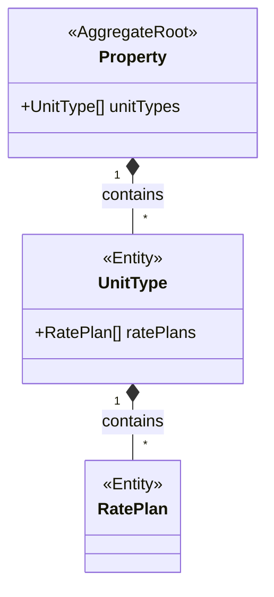

# Introduction

Use the Club API to access contacts, conversations, group messages, and more and seamlessly integrate your product into the workflows of dozens of devoted Club users.

## Getting started

To get started, create a new application in your developer settings, then read about how to make requests for the resources you need to access using our HTTP APIs or dedicated client SDKs. When your integration is ready to go live, publish it to our integrations directory to reach the Club community.

| Field1 | Field2 | Description |
| --- | --- | --- |
| Contacts | Conversations | Group messages |
 | Properties | Tasks | Webhooks |

```php
<?php

namespace App\Models;

class Property extends Model
{
    public function unitTypes()
    {
        return $this->hasMany(UnitType::class);
    }
}
```

